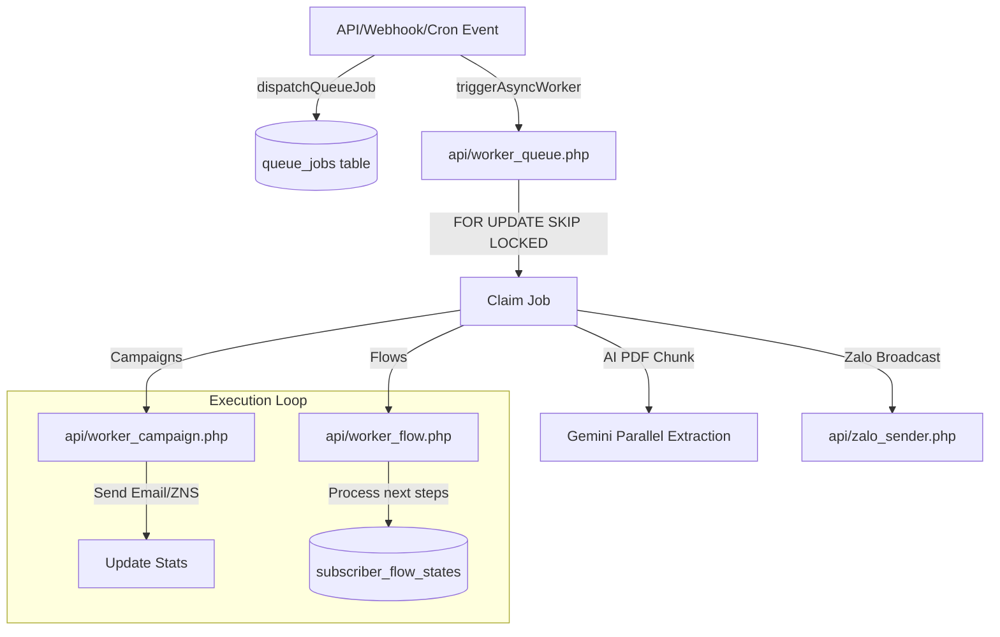

# 🗺️ Master Codebase Map & Architectural Guide (AutoFlow & AI Space)

This document is the high-density directory and architectural guide of the AutoFlow and AI Space fullstack repository. It serves as a token-saving reference. **Incoming agents must read this map first before modifying code or scanning the directory.**

---

## 🏢 1. System Boundaries & Core Architecture

The codebase is split into two distinct sub-applications sharing a common database and tracking pool:

| Attribute | AutoFlow (Marketing Automation) | AI Space (AI Chat & Workspace) |
| :--- | :--- | :--- |
| **Purpose** | Campaign management, audience tracking, marketing flows, builders, and channel integrations. | Multi-bot custom chats, category training documents, global RAG workspace, and collaborative tools. |
| **User Table** | `users` | `ai_org_users` (Roles: `admin`, `assistant`, `user`) |
| **Auth Session** | `$_SESSION['user_id']` | `$_SESSION['org_user_id']` |
| **API Auth** | Session-based | Session or Bearer Token (`ai_org_access_tokens`) |
| **Middleware** | `api/auth_middleware.php` | `api/ai_org_middleware.php` (`requireAISpaceAuth()`) |
| **Routes** | `/campaigns`, `/flows`, `/audience`, `/templates`, `/reports`, `/tags`, `/settings` | `/chat-category/:categoryId/*` |
| **Key Endpoints** | `api/campaigns.php`, `api/flows.php`, `api/subscribers.php` | `api/ai_chatbot.php`, `api/ai_org_auth.php`, `api/ai_training.php` |

---

## 🔐 2. Authentication & Authorization Guide (AI Space)

All AI Space API endpoints **MUST** enforce the organization user session/token checks:

```php
// Step 1 & 2: Include middleware and verify authentication (returns 401 if fails)
require_once 'db_connect.php';
require_once 'ai_org_middleware.php';
$currentUser = requireAISpaceAuth(); // Holds id, email, full_name, role, permissions, status

// Step 3: Verify category access (for category-specific actions)
$categoryId = $_GET['category_id'] ?? '';
requireCategoryAccess($categoryId, $currentUser);

// Step 4: Verify specific permission and log activity
requirePermission('manage_training', $currentUser);
logUserActivity($currentUser['id'], 'view_training_data', ['category_id' => $categoryId]);
```

### 🚫 Common Mistakes to Avoid
*   **Mixing Sessions**: Never use `$_SESSION['user_id']` (AutoFlow owner) for AI Space actions; always verify with `requireAISpaceAuth()` to read `ai_org_users`.
*   **Skipping Auth Checks**: Never fetch, delete, or modify training chunks/documents without calling `requireAISpaceAuth()` and validating category access.

---

## 📂 3. Directory Layout & Structure

```
/
├── App.tsx                     # Main React frontend router and layout coordinator
├── index.html                  # Frontend index entry
├── index.tsx                   # Frontend React DOM mounter
├── package.json                # Project dependencies (React 18, TypeScript, Vite)
├── types.ts                    # Main TypeScript interfaces (Campaign, Flow, Subscriber, etc.)
├── CODEBASE_MAP.md             # This unified high-density codebase map
├── api/                        # Backend PHP API, Cron scripts, Queue workers
│   ├── cron/                   # Specific cron tasks
│   ├── sessions/               # PHP session file store
│   └── *.php                   # Endpoint controllers & queue workers (see Section 5)
├── components/                 # Frontend React components (Campaigns, Flows, Audience, AI, UI, Zalo, Meta)
├── contexts/                   # React Contexts (ChatPageContext, NavigationContext, ThemeContext)
├── hooks/                      # Custom React Hooks (useAuthUser, useFileHandler, useWorkspaceDocs, useChatHistory)
├── pages/                      # Top-level Page Views (Audience, CategoryChatPage, AITraining, Settings, Campaigns, Flows)
├── services/                   # Frontend API connectors (flowValidationService, storageAdapter, tokenManager)
└── utils/                      # Helper libraries (demoMocks, markdownRenderer)
```

---

## 🗄️ 4. Database Schema Map

Core tables extracted from [api/database.sql](file:///e:/AUTOFLOW/DOMATION_FULLSTACK/DOMATION_FULLSTACK/DOMATION_FULLSTACK/api/database.sql):

### A. Core Marketing (AutoFlow)
*   `users`: Platform administrators & owners.
*   `subscribers`: Audience contacts with UUID. Tracks metrics (opens, clicks), phone, and tags.
*   `subscriber_activity`: Event history log (clicks, opens, unsubscribes) per subscriber.
*   `campaigns`: Campaign headers. Statuses: `draft`, `scheduled`, `sending`, `sent`, `paused`.
*   `campaign_reminders`: Follow-up triggers on `no_open` or `no_click`.
*   `flows`: Marketing flows with step configuration JSON.
*   `flow_enrollments`: Tracks active subscriber progress inside a flow.
*   `subscriber_flow_states`: Queue of waiting subscribers inside flows.
*   `lists` & `subscriber_lists`: Static lists mapping subscriber associations.
*   `segments` & `segment_exclusions`: Dynamic segment configurations and exclusions.

### B. AI Space Subsystem
*   `ai_org_users`: Org members (Roles: `admin`, `assistant`, `user`). Statuses: `active`, `banned`, `warning`.
*   `ai_org_user_categories`: Category-to-user access mapping.
*   `ai_org_conversations`: Workspace chat metadata (title, summary, tags, sentiment, is_pinned).
*   `ai_org_messages`: Workspace chat messages with token counts and ratings.
*   `ai_org_access_tokens` & `ai_org_refresh_tokens`: API tokens and persistent login tokens.
*   `ai_chatbots` & `ai_chatbot_settings`: Bot listings and configs (persona, quick actions, RAG options).
*   `ai_training_docs`: Knowledge base documents (URLs, PDFs, Scraps). Statuses: `pending`, `processing`, `trained`.
*   `ai_training_chunks`: Embedding chunks (`embedding` JSON / `embedding_binary`) used for RAG scoring.
*   `ai_workspace_files` & `ai_workspace_versions`: Collaborative workspace shared files and version control.

### C. Channel Integrations
*   `zalo_oa_configs`: Zalo Official Account access/refresh tokens.
*   `zalo_subscribers` & `zalo_user_messages`: Zalo contacts mapping and chat history logs.
*   `zalo_broadcasts` & `zalo_message_queue`: Outbound push tracking.
*   `meta_app_configs` & `meta_subscribers`: Meta App settings and FB/IG messenger contact mapping.

### D. Queue & System Control
*   `queue_jobs`: Asynchronous jobs pool. Statuses: `pending`, `processing`, `completed`, `failed`.
*   `api_rate_limits`: IP-based anti-spam request limiters.
*   `system_audit_logs`: Detailed tracking of administrative action audits.
*   `system_settings`: Platform-wide configurations.

---

## 🔌 5. API Endpoints Map (`/api`)

Backend API endpoints written in PHP using [api/db_connect.php](file:///e:/AUTOFLOW/DOMATION_FULLSTACK/DOMATION_FULLSTACK/DOMATION_FULLSTACK/api/db_connect.php) for connectivity:

### A. Auth & System Management
*   [api/auth.php](file:///e:/AUTOFLOW/DOMATION_FULLSTACK/DOMATION_FULLSTACK/DOMATION_FULLSTACK/api/auth.php): AutoFlow login/registration.
*   [api/ai_org_auth.php](file:///e:/AUTOFLOW/DOMATION_FULLSTACK/DOMATION_FULLSTACK/DOMATION_FULLSTACK/api/ai_org_auth.php): AI Space login, registration, and tokens.
*   [api/system_health_check.php](file:///e:/AUTOFLOW/DOMATION_FULLSTACK/DOMATION_FULLSTACK/DOMATION_FULLSTACK/api/system_health_check.php): Core health status metrics.

### B. Marketing Operations
*   [api/campaigns.php](file:///e:/AUTOFLOW/DOMATION_FULLSTACK/DOMATION_FULLSTACK/DOMATION_FULLSTACK/api/campaigns.php) & [api/templates.php](file:///e:/AUTOFLOW/DOMATION_FULLSTACK/DOMATION_FULLSTACK/DOMATION_FULLSTACK/api/templates.php): CRUD and setups.
*   [api/flows.php](file:///e:/AUTOFLOW/DOMATION_FULLSTACK/DOMATION_FULLSTACK/DOMATION_FULLSTACK/api/flows.php): Design, step layouts, and enrollments.
*   [api/subscribers.php](file:///e:/AUTOFLOW/DOMATION_FULLSTACK/DOMATION_FULLSTACK/DOMATION_FULLSTACK/api/subscribers.php) & [api/segments.php](file:///e:/AUTOFLOW/DOMATION_FULLSTACK/DOMATION_FULLSTACK/DOMATION_FULLSTACK/api/segments.php): Profiles, custom attributes, tags, and segmentation.
*   [api/voucher_campaigns.php](file:///e:/AUTOFLOW/DOMATION_FULLSTACK/DOMATION_FULLSTACK/DOMATION_FULLSTACK/api/voucher_campaigns.php), [api/voucher_claim.php](file:///e:/AUTOFLOW/DOMATION_FULLSTACK/DOMATION_FULLSTACK/DOMATION_FULLSTACK/api/voucher_claim.php), & [api/voucher_codes.php](file:///e:/AUTOFLOW/DOMATION_FULLSTACK/DOMATION_FULLSTACK/DOMATION_FULLSTACK/api/voucher_codes.php): Voucher distribution system.

### C. AI Space, RAG, & Channels
*   [api/ai_chatbot.php](file:///e:/AUTOFLOW/DOMATION_FULLSTACK/DOMATION_FULLSTACK/DOMATION_FULLSTACK/api/ai_chatbot.php) & [api/ai_org_chatbot.php](file:///e:/AUTOFLOW/DOMATION_FULLSTACK/DOMATION_FULLSTACK/DOMATION_FULLSTACK/api/ai_org_chatbot.php): Workspace & guest chat engine with RAG integration.
*   [api/ai_training.php](file:///e:/AUTOFLOW/DOMATION_FULLSTACK/DOMATION_FULLSTACK/DOMATION_FULLSTACK/api/ai_training.php) & [api/ai_training_core.php](file:///e:/AUTOFLOW/DOMATION_FULLSTACK/DOMATION_FULLSTACK/DOMATION_FULLSTACK/api/ai_training_core.php): Document extraction, Gemini embedding generator.
*   [api/webhook.php](file:///e:/AUTOFLOW/DOMATION_FULLSTACK/DOMATION_FULLSTACK/DOMATION_FULLSTACK/api/webhook.php) & [api/meta_webhook.php](file:///e:/AUTOFLOW/DOMATION_FULLSTACK/DOMATION_FULLSTACK/DOMATION_FULLSTACK/api/meta_webhook.php): Zalo OA and Facebook/Instagram Webhooks.
*   [api/track.php](file:///e:/AUTOFLOW/DOMATION_FULLSTACK/DOMATION_FULLSTACK/DOMATION_FULLSTACK/api/track.php): Public script tracking entry point (populates web activities).

---

## ⚙️ 6. Background Worker Engine

Heavy queues are run asynchronously to maximize performance:



### Main Controller: `api/worker_queue.php`
*   **Execution Lock**: Restricts double processing via `api/worker_running.lock` file (reclaimed if > 5 minutes stale).
*   **Concurrency**: Extracts pending queue items using B-tree indexing and row-level locks via `SKIP LOCKED`.
*   **Batch & Limits**: Processes default `max_jobs = 100` (max 1000 per invocation). Stuck jobs (> 15 minutes processing) are automatically recycled.
*   **Fails & Exponential Backoff**: Retries jobs up to 3 times, delaying next attempts by `5^attempts` minutes. Errors are logged to `api/worker_error.log`.
*   **Memory Leak Guard**: Invokes `gc_collect_cycles()` every 10 jobs to prevent memory bloat in daemon environments.

### Core Processing Workers:
*   [api/worker_campaign.php](file:///e:/AUTOFLOW/DOMATION_FULLSTACK/DOMATION_FULLSTACK/DOMATION_FULLSTACK/api/worker_campaign.php): Handles high-volume campaign delivery. Uses connection checks to avoid MySQL server timeouts.
*   [api/worker_flow.php](file:///e:/AUTOFLOW/DOMATION_FULLSTACK/DOMATION_FULLSTACK/DOMATION_FULLSTACK/api/worker_flow.php): Processes subscriber flow progression tasks where `scheduled_at <= NOW()`.
*   [api/worker_reminder.php](file:///e:/AUTOFLOW/DOMATION_FULLSTACK/DOMATION_FULLSTACK/DOMATION_FULLSTACK/api/worker_reminder.php): Dispatches scheduled reminders.
*   [api/worker_priority.php](file:///e:/AUTOFLOW/DOMATION_FULLSTACK/DOMATION_FULLSTACK/DOMATION_FULLSTACK/api/worker_priority.php): Bypasses normal execution locks to prioritize urgent transactional tasks.

---

## 🛡️ 7. Critical Coding Patterns & Concurrency Guards

### A. Database JSON Safe Updates
Direct `JSON_SET` crashes MariaDB if the column value is `NULL` or empty.
*   **Pattern**: Wrap columns in `COALESCE(NULLIF(col, ''), '{}')`:
    ```sql
    UPDATE campaigns SET stats = JSON_SET(COALESCE(NULLIF(stats, ''), '{}'), '$.sent', 100) WHERE id = ?;
    ```

### B. High-Concurrency Row Locking & Indexing
Executing `SELECT ... FOR UPDATE` without composite B-tree index matches locks the entire table.
*   **Pattern**: Ensure locking columns are covered by indexes. Use `SKIP LOCKED` in background daemons:
    ```sql
    SELECT id FROM queue_jobs WHERE status = 'pending' LIMIT 10 FOR UPDATE SKIP LOCKED;
    ```

### C. PHP Session Blocking Resolution
Standard session configurations block concurrent user AJAX requests.
*   **Pattern**: Close the write-handle immediately after fetching authentication properties:
    ```php
    // In db_connect.php (on reading user session information):
    session_write_close();
    ```

### D. Re-connection Charset Integrity
Long-lived loops that lose DB connectivity must restore character set config on reconnecting.
*   **Pattern**: Reuse the global DSN variable in `ensure_pdo_alive(&$pdo)` to protect Vietnamese encoding:
    ```php
    global $dsn, $user, $pass, $options;
    $pdo = new PDO($dsn, $user, $pass, $options);
    ```

### E. PHP/MySQL Prepared Statement Placeholder Limits
Prepared statements fail if the placeholder count exceeds 65,535 parameters.
*   **Pattern**: Chunk all large arrays into groups of 500:
    ```php
    $chunks = array_chunk($subscriberIds, 500);
    foreach ($chunks as $chunk) {
        $placeholders = implode(',', array_fill(0, count($chunk), '?'));
        $stmt = $pdo->prepare("DELETE FROM subscribers WHERE id IN ($placeholders)");
        $stmt->execute($chunk);
    }
    ```

### F. Cryptographically Secure IDs
*   **Pattern**: Do NOT use `uniqid()` as it collides under high concurrency. Always use:
    ```php
    $id = bin2hex(random_bytes(16)); // Secure 32-character hexadecimal UUID
    ```
